# Manual Técnico de Linux Ubuntu: Comandos Fundamentales y Servidor Web Apache2

**Universidad de San Carlos de Guatemala**  
**Facultad de Ingeniería**  
**Escuela de Ciencias y Sistemas**  
**Curso / Módulo:** Prácticas Iniciales  
**Nombre del Estudiante:** Sergio Roberto Gudiel Sian  
**Carné:** 201404365  
**Sistema Operativo:** Ubuntu Linux (Virtualizado en Oracle VM VirtualBox v7.0)  
**Fecha de Entrega:** 27 de Agosto de 2026  

---

## 1. Resumen de Entorno y Arquitectura Linux

### 1.1. Comparativa entre Windows y Ubuntu Linux (POSIX/UNIX)
A diferencia de los sistemas operativos de la familia Windows, los cuales estructuran sus almacenamiento mediante letras de unidad (`C:\`, `D:\`) y ejecutan instrucciones basadas en la sintaxis de PowerShell o CMD, **Ubuntu Linux** se rige por el estándar de arquitectura **POSIX/UNIX**. 

Las características conceptuales clave son:
- **Directorio Raíz Único (`/`)**: En Linux no existen letras de discos. Todos los dispositivos de almacenamiento, particiones y recursos se montan como directorios dentro de un único árbol de archivos jerárquico cuya raíz es `/`.
- **Sensibilidad a Mayúsculas (Case-Sensitivity)**: El intérprete de comandos **Bash** distingue estrictamente entre caracteres mayúsculos y minúsculos. Por ende, `Reporte.txt`, `reporte.txt` y `REPORTE.TXT` identifican tres archivos completamente independientes.
- **Separador de Rutas**: Utiliza la barra diagonal (`/`) en lugar de la barra invertida (`\`) empleada en Windows.
- **Sistema de Permisos Robusto**: Cada archivo y directorio posee un propietario, un grupo asociado y una triple terna de permisos (*Lectura - r*, *Escritura - w*, *Ejecución - x*), lo cual otorga un nivel superior de seguridad operativa.

---

## 2. Comandos de Navegación del Sistema de Archivos

### 2.1. Comando `pwd` (Print Working Directory)
Imprime en pantalla la ruta absoluta del directorio de trabajo actual donde se encuentra posicionado el usuario en la terminal.

#### Variantes y Opciones del Comando `pwd`
| Comando / Opción | Descripción y Uso Práctico |
| :--- | :--- |
| `pwd` | Imprime la ruta del directorio actual resolviendo enlaces simbólicos por defecto. |
| `pwd -P` | Muestra la ruta física real del directorio actual, resolviendo de manera estricta cualquier enlace simbólico (*symlink*). |
| `pwd -L` | Muestra la ruta lógica (incluyendo enlaces simbólicos sin resolver). |

#### Ejemplo Práctico de `pwd`
```bash
vboxuser@Ubuntu:~$ pwd
/home/vboxuser
vboxuser@Ubuntu:~$ pwd -P
/home/vboxuser
```


---

### 2.2. Comando `cd` (Change Directory)
Permite desplazarse o cambiar el directorio de trabajo actual dentro del árbol de carpetas de Linux.

#### Variantes y Opciones del Comando `cd`
| Comando / Sintaxis | Comportamiento y Destino |
| :--- | :--- |
| `cd /ruta/destino` | Navega hacia una ruta absoluta o relativa específica. |
| `cd ..` | Sube un nivel en la jerarquía de directorios (directorio padre). |
| `cd ../..` | Sube dos niveles consecutivos en la jerarquía de directorios. |
| `cd /` | Navega directamente al directorio raíz del sistema. |
| `cd` o `cd ~` | Regresa inmediatamente al directorio personal del usuario (`/home/usuario`). |
| `cd -` | Regresa al directorio de trabajo anterior (útil para alternar entre dos rutas). |

#### Ejemplo Práctico de `cd`
```bash
vboxuser@Ubuntu:~$ cd /home/vboxuser/Desktop/Usac/Segundo\ semestre/Practicas\ iniciales/
vboxuser@Ubuntu:~/Desktop/Usac/Segundo semestre/Practicas iniciales$ cd ../..
vboxuser@Ubuntu:~/Desktop/Usac$ cd -
/home/vboxuser/Desktop/Usac/Segundo semestre/Practicas iniciales
vboxuser@Ubuntu:~/Desktop/Usac/Segundo semestre/Practicas iniciales$ cd /
vboxuser@Ubuntu:/$ cd -
```

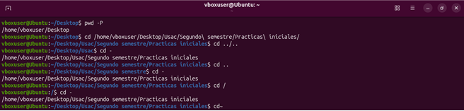

---

## 3. Comandos de Listado y Creación de Directorios

### 3.1. Comando `ls` (List)
Lista el contenido (archivos y subdirectorios) dentro del directorio especificado o actual.

#### Variantes y Opciones del Comando `ls`
| Variante / Opción | Función y Resultado |
| :--- | :--- |
| `ls` | Muestra los archivos y carpetas visibles en formato simple. |
| `ls -l` | Formato detallado (*long format*): muestra permisos, número de enlaces, propietario, grupo, tamaño en bytes y fecha de última modificación. |
| `ls -a` | Muestra **todos** los archivos y carpetas, incluyendo los elementos ocultos (aquellos cuyos nombres inician con un punto `.`). |
| `ls -al` / `ls -la` | Combina el listado detallado con la visualización de archivos ocultos. |
| `ls -lh` | Muestra los tamaños de archivo en formato legible para humanos (KiB, MiB, GiB). |
| `ls -lt` | Ordena los elementos según la fecha de última modificación (el más reciente primero). |
| `ls -R` | Listado recursivo: despliega jerárquicamente el contenido del directorio actual y de todos sus subdirectorios. |

#### Ejemplo Práctico de `ls`
```bash
vboxuser@Ubuntu:~/Desktop/Usac/Segundo semestre/Practicas iniciales$ ls -al
vboxuser@Ubuntu:~/Desktop/Usac/Segundo semestre/Practicas iniciales$ ls -lt
vboxuser@Ubuntu:~/Desktop/Usac/Segundo semestre$ ls -R
```

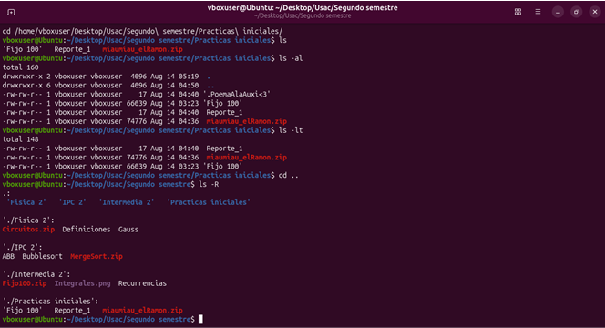

---

### 3.2. Comando `mkdir` (Make Directory)
Crea uno o varios directorios o carpetas en la ruta indicada.

#### Variantes y Opciones del Comando `mkdir`
| Variante / Sintaxis | Uso y Caso de Aplicación |
| :--- | :--- |
| `mkdir nombre_carpeta` | Crea una única carpeta en el directorio actual. |
| `mkdir -p ruta/a/carpeta/anidada` | Crea la estructura completa de carpetas padre e hijas si no existen de forma previa (*parents*). |
| `mkdir c1 c2 c3` | Crea múltiples carpetas independientes de manera simultánea en una sola instrucción. |
| `mkdir -m 755 carpeta` | Crea el directorio asignándole permisos específicos al momento de su creación. |

#### Ejemplo Práctico de `mkdir`
```bash
vboxuser@Ubuntu:~/Desktop/Usac/Segundo semestre$ mkdir Lenguajes_Formales
vboxuser@Ubuntu:~/Desktop/Usac/Segundo semestre$ mkdir -p Lenguajes_Formales/LabLenguajes/Practicas
vboxuser@Ubuntu:~/Desktop/Usac/Segundo semestre/Lenguajes_Formales$ mkdir Proyecto1 Proyecto2 Cortos
```

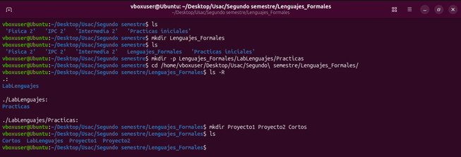

---

## 4. Comandos de Manipulación de Archivos y Directorios

### 4.1. Comando `cp` (Copy)
Copia archivos o directorios desde una ruta origen hacia un destino especificado.

#### Variantes y Opciones del Comando `cp`
| Variante / Opción | Comportamiento |
| :--- | :--- |
| `cp origen destino` | Copia un archivo simple de un punto a otro. |
| `cp -r` / `cp -R` | Copia recursiva: necesaria para duplicar directorios completos junto con todo su contenido interno. |
| `cp -i` | Modo interactivo: solicita confirmación al usuario antes de sobrescribir un archivo existente. |
| `cp -v` | Modo explicativo (*verbose*): muestra detalladamente en pantalla el proceso del copiado elemento por elemento. |
| `cp -u` | Copia únicamente cuando el archivo origen es más reciente que el archivo destino o cuando el destino no existe. |

#### Ejemplo Práctico de `cp`
```bash
vboxuser@Ubuntu:~/Desktop/Usac/Segundo semestre$ cp Recurrencias Intermedia\ 2/
vboxuser@Ubuntu:~/Desktop/Usac/Segundo semestre$ cp -r Lenguajes_Formales/ IPC\ 2/
```

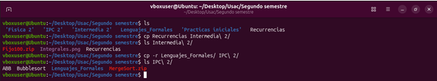

---

### 4.2. Comando `mv` (Move)
Mueve archivos o directorios de ubicación en el sistema o renombra un archivo/directorio si la ruta de destino corresponde al mismo directorio de origen.

#### Variantes y Opciones del Comando `mv`
| Variante / Opción | Efecto / Función |
| :--- | :--- |
| `mv viejo_nombre nuevo_nombre` | Renombra un archivo o carpeta dentro del mismo directorio. |
| `mv archivo /nueva/ruta/` | Mueve el archivo a otra carpeta manteniendo su nombre original. |
| `mv -i` | Modo interactivo: advierte antes de reemplazar un archivo de destino que ya existe. |
| `mv -v` | Modo explícito: imprime en pantalla el resultado del desplazamiento o renombrado. |
| `mv -n` | No sobrescribe ningún archivo existente en el destino (*no-clobber*). |

#### Ejemplo Práctico de `mv`
```bash
vboxuser@Ubuntu:~/Desktop/Usac$ mv ABB Recurrencias /home/vboxuser/Desktop/Usac/Segundo\ semestre/
vboxuser@Ubuntu:~/Desktop/Usac/Segundo semestre$ mv ABB IPC\ 2/
vboxuser@Ubuntu:~/Desktop/Usac/Segundo semestre$ mv Recurrencias newDoc
```

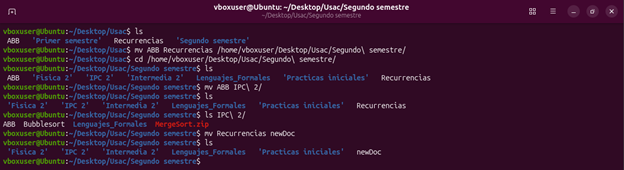

---

### 4.3. Comando `rm` (Remove)
Elimina archivos y directorios de manera permanente de la estructura del sistema de archivos.

> **Precaución:** En entornos de consola Linux no existe una "Papelera de Reciclaje" por defecto. Los archivos eliminados con `rm` no se pueden recuperar fácilmente.

#### Variantes y Opciones del Comando `rm`
| Variante / Opción | Riesgo y Comportamiento |
| :--- | :--- |
| `rm archivo.txt` | Elimina un archivo regular individual. |
| `rm -r` / `rm -R` | Eliminación recursiva: borra carpetas y todo su contenido interno (archivos y subcarpetas). |
| `rm -f` | Modo forzado (*force*): ignora confirmaciones, borra archivos protegidos y no despliega advertencias si el archivo no existe. |
| `rm -rf carpeta/` | **ELIMINACIÓN FORZADA RECURSIVA:** Borra directorios completos sin solicitar confirmación. Debe ejecutarse con extrema precaución. |
| `rm -i` | Solicita confirmación antes de borrar cada archivo. |

#### Ejemplo Práctico de `rm`
```bash
vboxuser@Ubuntu:~/Desktop/Usac/Segundo semestre$ rm newDoc
vboxuser@Ubuntu:~/Desktop/Usac/Segundo semestre$ rm -r Intermedia\ 2/
```

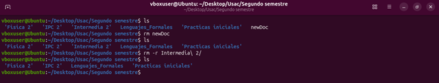

---

### 4.4. Comando `rmdir` (Remove Directory)
Elimina exclusivamente directorios que se encuentren **completamente vacíos**.

#### Variantes y Opciones del Comando `rmdir`
| Variante / Opción | Función |
| :--- | :--- |
| `rmdir nombre_carpeta` | Elimina la carpeta seleccionada únicamente si no contiene ningún archivo o subdirectorio. |
| `rmdir -p ruta/anidada` | Elimina la carpeta hija y sus carpetas madre jerárquicas si estas también quedan vacías tras la eliminación. |
| `rmdir --ignore-fail-on-non-empty` | Ignora el mensaje de falla si el directorio contiene elementos. |

#### Ejemplo Práctico de `rmdir`
```bash
vboxuser@Ubuntu:~/Desktop/Usac/Segundo semestre$ rmdir IPC\ 2/
rmdir: failed to remove 'IPC 2/': Directory not empty
vboxuser@Ubuntu:~/Desktop/Usac/Segundo semestre$ rmdir Quimica/
```

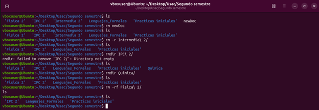

---

## 5. Conceptos Complementarios de Administración CLI

### 5.1. Elevación de Privilegios (`sudo` y `su`)
- **`sudo` (Superuser Do)**: Permite a un usuario autorizado ejecutar un comando individual con privilegios de administrador (*root*). Se utiliza como buena práctica para evitar trabajar constantemente como root.
- **`su` (Switch User)**: Permite cambiar la sesión actual a la de otro usuario (por ejemplo, `su -` para cambiar a la cuenta raíz de *root*).

### 5.2. Gestión de Permisos (`chmod` y `chown`)
- **`chmod` (Change Mode)**: Modifica los permisos de acceso de un archivo/directorio.
  - *Modo Octal*: `chmod 755 archivo` (Propietario: rwx [7], Grupo: r-x [5], Otros: r-x [5]).
  - *Modo Simbólico*: `chmod +x script.sh` (Añade permiso de ejecución).
- **`chown` (Change Owner)**: Cambia el usuario propietario y/o el grupo propietario del recurso.
  - Ejemplo: `sudo chown -R vboxuser:vboxuser /var/www/html/`

---

## 6. Instalación, Configuración y Verificación del Servidor Web Apache2

### 6.1. ¿Qué es Apache2 y cómo funciona en Ubuntu Linux?
**Apache2** (Apache HTTP Server) es un servidor web HTTP de código abierto y multiplataforma, desarrollado por la Apache Software Foundation. Es ampliamente utilizado en la infraestructura global de Internet para despachar contenido web (estático y dinámico).

En Ubuntu y sistemas derivados de Debian:
- Los archivos de configuración residen en el directorio `/etc/apache2/`.
- La ruta raíz por defecto para almacenar páginas web públicas (*DocumentRoot*) es `/var/www/html/`.
- La gestión del proceso del servidor se realiza mediante el sistema de iniciación **systemd** a través del comando `systemctl`.

---

### 6.2. Paso 1: Actualización del Índice de Paquetes (`sudo apt update`)
Antes de instalar cualquier servicio en Ubuntu, es imprescindible sincronizar el índice local de paquetes con los repositorios oficiales para garantizar la descarga de las últimas versiones estables.

```bash
vboxuser@Ubuntu:~$ sudo apt update
```

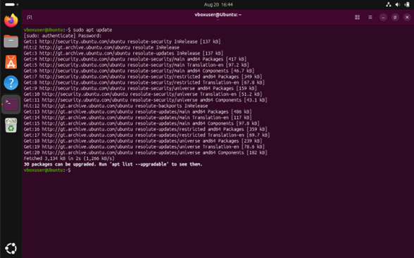

---

### 6.3. Paso 2: Instalación del Paquete Apache2 (`sudo apt install apache2`)
Se procede a instalar el demonio HTTP Apache2 mediante el gestor de paquetes `apt`.

```bash
vboxuser@Ubuntu:~$ sudo apt install apache2
```
Durante el proceso se confirma el uso de espacio en disco escribiendo `y` cuando la terminal lo solicite.

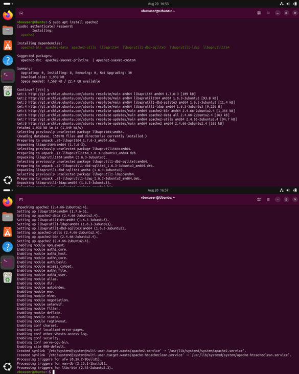

---

### 6.4. Paso 3: Verificación del Estado del Servicio (`sudo systemctl status apache2`)
Una vez concluida la instalación, el servicio `apache2` se inicia y habilita automáticamente en el arranque del sistema. Para comprobar que la unidad esté activa y en ejecución (*active (running)*), se ejecuta:

```bash
vboxuser@Ubuntu:~$ sudo systemctl status apache2
```
*(Nota: Para salir de la vista detallada de status se presiona la tecla `q`).*

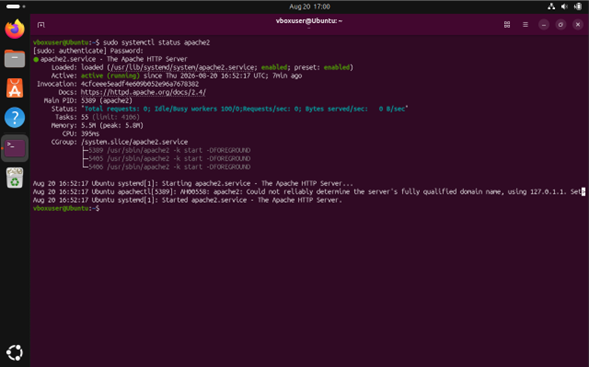

#### Comandos Útiles de Gestión del Servicio Apache2
- **Iniciar el servicio:** `sudo systemctl start apache2`
- **Detener el servicio:** `sudo systemctl stop apache2`
- **Reiniciar el servicio:** `sudo systemctl restart apache2`
- **Recargar configuración sin cortar conexiones:** `sudo systemctl reload apache2`
- **Habilitar inicio automático:** `sudo systemctl enable apache2`

---

### 6.5. Paso 4: Comprobación Inicial en Navegador Web (`http://localhost`)
Se abre el navegador web integrado (Mozilla Firefox) y se accede a la URL `http://localhost` (o dirección de bucle de retorno `127.0.0.1`). Se despliega la página por defecto **"Apache2 Ubuntu Default Page"**, validando que el servidor web atiende peticiones en el puerto 80.

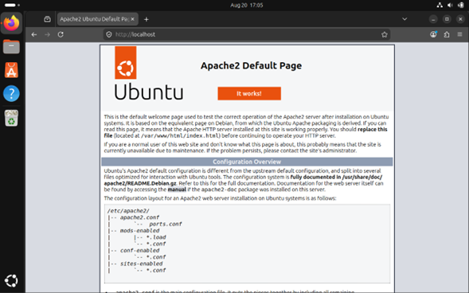

---

### 6.6. Paso 5: Navegación al Directorio DocumentRoot (`/var/www/html/`)
Para personalizar el contenido presentado por el servidor web, es necesario desplazarse al directorio público mediante los comandos de consola explicados previamente:

```bash
vboxuser@Ubuntu:~$ cd /var/www/html/
vboxuser@Ubuntu:/var/www/html$ pwd
/var/www/html
vboxuser@Ubuntu:/var/www/html$ ls
index.html
```

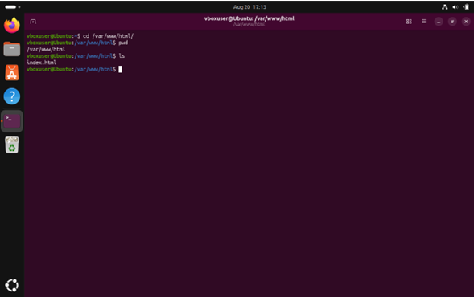

---

### 6.7. Paso 6: Edición del Archivo `index.html` con Editor CLI `nano`
Haciendo uso del editor de texto ligero en consola `nano` y con privilegios de superusuario (`sudo`), se edita el archivo `index.html` para incluir la información requerida (Carné y Nombre Completo):

```bash
vboxuser@Ubuntu:/var/www/html$ sudo nano index.html
```

#### Estructura del Código HTML Implementado:
```html
<!DOCTYPE html>
<html>
<head>
    <title>Reporte 3</title>
</head>
<body>
    <h1>Reporte 3 - Apache2</h1>
    <p><b>Carnet:</b> 201404365</p>
    <p><b>Nombre:</b> Sergio Roberto Gudiel Sian</p>
</body>
</html>
```

*(En `nano`: Guardar con `Ctrl + O`, presionar `Enter`, y salir con `Ctrl + X`).*

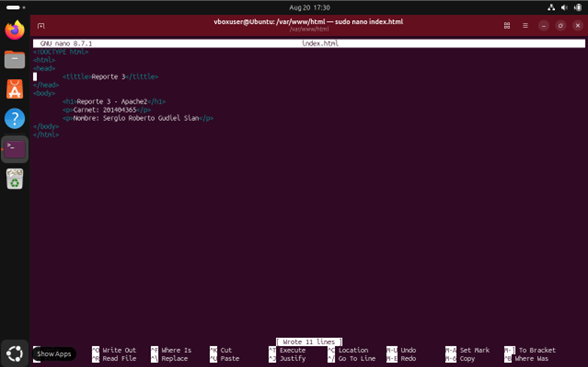

---

### 6.8. Paso 7: Validación Final del Sitio Web en `http://localhost`
Se recarga la página web en Mozilla Firefox visitando `http://localhost`. Se corrobora que el servidor responde correctamente mostrando el nuevo contenido HTML configurado con el Nombre y Carné del estudiante.

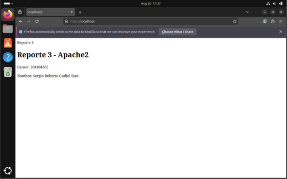

---

## 7. Conclusiones y Consideraciones Técnicas

1. **Eficiencia de la Interfaz CLI**: El dominio de los comandos básicos de navegación (`cd`, `pwd`, `ls`), gestión (`mkdir`, `cp`, `mv`, `rm`, `rmdir`) y edición (`nano`) resulta fundamental para interactuar con servidores Linux donde no se dispone de entorno gráfico.
2. **Servicios en la Nube y Servidores Web**: El despliegue de Apache2 demuestra la facilidad y rapidez con la que se pueden poner en marcha servicios de infraestructura en Linux mediante el gestor `apt` y el control de demonios con `systemctl`.
3. **Control e Integridad**: Entender la estructura de directorios como `/var/www/html/` y el manejo de permisos con `sudo` garantiza la correcta administración y seguridad del servidor web.
